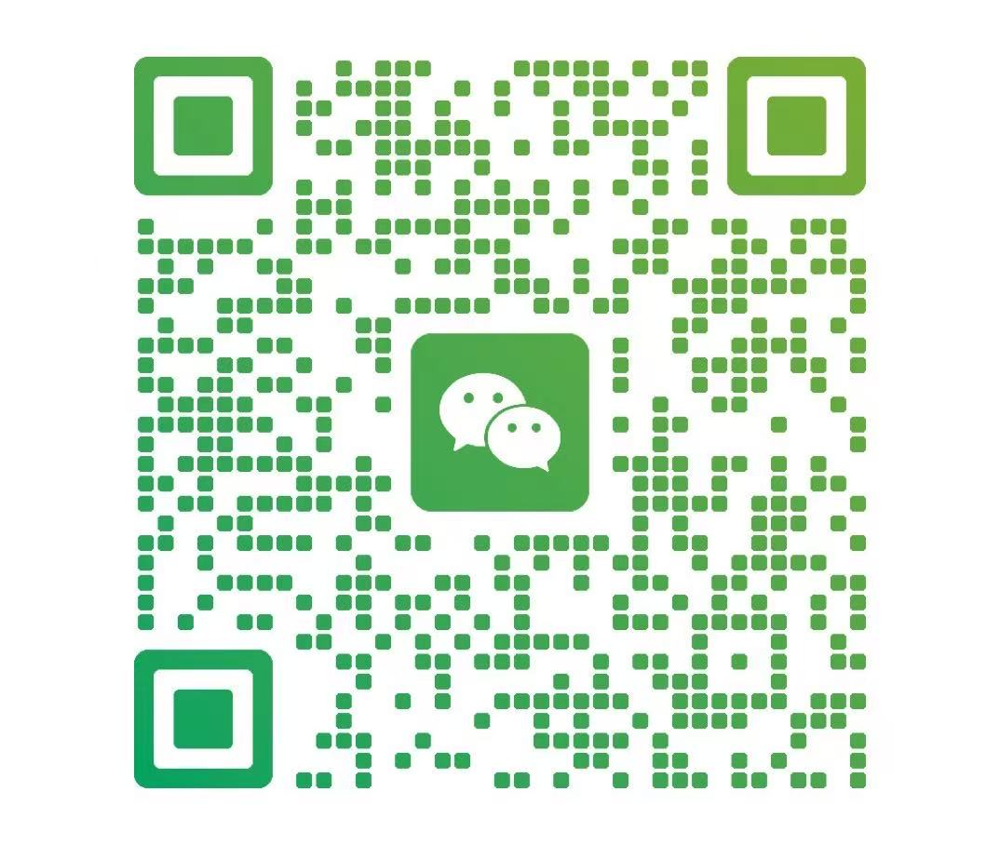

<div align="center">

# Awesome GPT-6 Case

**简体中文** | [English](README.en.md)

[](https://awesome.re)
[](CONTRIBUTING.md)
[](cases/)
[](LICENSE)

</div>

> 🚀 收集、整理和沉淀 **GPT-6 的真实应用案例、工作流与最佳实践**。
>
> 🚀 Collect, organize and document **real-world GPT-6 cases, workflows and best practices**.
>
> 不只展示"GPT-6 能做什么"，更关注：**它到底解决了什么问题，以及别人能不能复用。**
> Not just "what GPT-6 can do" — but **what problem it actually solved, and whether you can reuse it.**

如果说模型能力决定了 AI 的上限，那么真正决定 AI 能否创造价值的，是 **Case**。

这个仓库希望持续记录 GPT-6 在真实工作、学习、创作、开发和商业场景中的优秀实践。

**新来的话，先看这里：**

- 想提交案例 → [CONTRIBUTING.md](CONTRIBUTING.md)（含复制即用的 [案例模板](templates/case-template.md)）
- 只想推荐一个链接 → [提交 Issue](https://github.com/hugo0129/awesome-gpt6/issues/new/choose)
- 想翻案例 → [cases/](cases/)

---

## 为什么创建这个项目？

每一代大模型发布之后，互联网上都会迅速出现大量：

- 功能介绍
- Benchmark
- Prompt 分享
- 产品测评
- 新闻解读

但真正有价值的东西往往散落在不同地方：

> **某个人到底如何用 GPT-6 完成了一件以前很难完成的事情？**

例如：

- 一个产品经理如何让 GPT-6 从需求分析一路做到原型设计
- 一个程序员如何让 GPT-6 完成完整的软件开发任务
- 一个创业者如何让 GPT-6 帮助完成市场调研、商业分析和产品验证
- 一个老师如何使用 GPT-6 重新设计课程
- 一个设计师如何使用 GPT-6 完成从创意到视觉交付
- 一个普通人如何让 GPT-6 成为自己的 AI 助手
- 一个团队如何把 GPT-6 接入真实业务流程

这些真实案例，比单纯的 Prompt 更值得被记录。

希望这里最终成为一个：**GPT-6 真实应用案例库。**

---

## 案例目录 / Case Index

案例正文存放在 [`cases/`](cases/) 目录，按下面的分类归档。
Full case write-ups live in [`cases/`](cases/), organized by the categories below.

| # | 分类 / Category | 说明 / What's inside | 目录 / Folder |
| - | --------------- | -------------------- | ------------- |
| 01 | Thinking & Research | 研究、分析、推理、信息整理与复杂问题解决 | [`cases/01-thinking-research/`](cases/01-thinking-research/) |
| 02 | Coding | 软件开发、Vibe Coding、Debug、重构、Agent Coding | [`cases/02-coding/`](cases/02-coding/) |
| 03 | Design | UI、UX、品牌设计、视觉设计、产品原型 | [`cases/03-design/`](cases/03-design/) |
| 04 | Writing & Content | 文章、公众号、短视频、脚本、知识内容生产 | [`cases/04-writing-content/`](cases/04-writing-content/) |
| 05 | Data & Office | Excel、数据分析、报告、PPT、Word 与知识工作自动化 | [`cases/05-data-office/`](cases/05-data-office/) |
| 06 | Agent & Automation | Agent、Skills、MCP、自动化工作流与 AI 助手 | [`cases/06-agent-automation/`](cases/06-agent-automation/) |
| 07 | Business | 企业经营、市场、销售、客服、运营、管理 | [`cases/07-business/`](cases/07-business/) |
| 08 | Startup & OPC | 创业、超级个体、One Person Company 与 AI Native Business | [`cases/08-startup-opc/`](cases/08-startup-opc/) |
| 09 | Education | 教学、课程设计、学习、科研和教育创新 | [`cases/09-education/`](cases/09-education/) |
| 10 | Industry | 金融、制造、文旅、政务、零售等行业应用 | [`cases/10-industry/`](cases/10-industry/) |

目前全部为空 —— **第一批案例等你来写。**
All folders are empty right now — **the first batch of cases is waiting for you.**

> 表格里的案例链接会随着 PR 自动增长，也可以直接进分类目录看全部文件。
> Links will grow with every merged PR; you can also browse each folder directly.

---

## 什么样的 Case 值得收录？

我们更关注 **Case，而不是 Prompt**。

一个优秀案例最好能够回答下面几个问题：

### 1. Problem

原来遇到了什么问题？

### 2. Before

过去是怎么解决的？

### 3. GPT-6

GPT-6 在哪里介入？

### 4. Workflow

完整工作流是什么？

### 5. Result

最终得到了什么结果？

### 6. Value

它节省了多少时间、成本，或者创造了什么新的可能？

### 7. Reusable

其他人是否能够复用？

---

## Case 标准模板 / Case Template

推荐所有案例使用以下结构：

- 中文版 → [`templates/case-template.md`](templates/case-template.md)
- English → [`templates/case-template.en.md`](templates/case-template.en.md)

```markdown
# Case Name

## Background

案例背景。

## Problem

原来的问题是什么？

## Traditional Workflow

过去如何完成这项工作？

## GPT-6 Workflow

GPT-6 如何参与？

Step 1:

Step 2:

Step 3:

## Prompt / Context

关键 Prompt、上下文或者任务描述。

## Tools

使用的工具：

- GPT-6
- Codex
- GitHub
- Figma
- Canva
- MCP
- Other

## Result

最终结果。

## Before vs After

| Before | After |
|---|---|
| xxx | xxx |

## Key Insight

这个案例最值得学习的地方。

## Reusable For

这个方法还可以迁移到哪些场景？
```

---

## Case 评价标准 / Review Criteria

我们会优先收录具备以下特点的案例：

| Dimension  | Description           |
| ---------- | --------------------- |
| Real       | 来自真实任务，而不是为了演示 AI 而设计 |
| Useful     | 真正解决问题                |
| Reusable   | 其他人可以复用               |
| Complete   | 包含相对完整的过程             |
| Insightful | 能带来新的方法或认知            |
| Measurable | 最好有时间、成本、质量等结果对比      |

一句话：

> **不是"看起来很厉害"，而是"看完之后我也能用"。**
> Not "looks impressive" — but "I can do this too after reading it".

---

## 推荐提交的案例 / Cases We Want Most

尤其欢迎以下类型：

- GPT-6 完成过去需要数小时甚至数天的任务
- GPT-6 解决复杂专业问题
- GPT-6 与 Codex / GitHub / Figma / Canva 等工具协同
- GPT-6 Agent / Skills / MCP 工作流
- GPT-6 企业真实业务应用
- GPT-6 OPC / 超级个体工作流
- GPT-6 创业案例
- GPT-6 教育案例
- GPT-6 内容生产案例
- GPT-6 Coding 案例
- GPT-6 多模态案例
- GPT-6 自动化案例
- GPT-6 中那些让你产生 **"原来还能这么干"** 感觉的案例

---

## 如何贡献 / How to Contribute

欢迎一起建设这个项目。四种方式，从轻到重：

| 方式 | 成本 | 适合谁 |
| --- | --- | --- |
| 点个 ⭐ / 分享 | 10 秒 | 所有人 |
| [提 Issue 推荐一个 Case](https://github.com/hugo0129/awesome-gpt6/issues/new/choose) | 2 分钟 | 只见过、没做过 |
| [提 PR 补一个 Case](CONTRIBUTING.md) | 20 分钟 | 自己做过，愿意写下来 |
| 帮忙 Review / 纠错 / 翻译 | 随时 | 想深度参与 |

完整规范见 [CONTRIBUTING.md](CONTRIBUTING.md)（[English](CONTRIBUTING.en.md)）。

Issue 建议格式：

```text
Case Name:

Case URL:

Category:

What problem does it solve?

Why is it awesome?

Can others reproduce it?
```

---

## 直接聊 / Talk to me directly

> 想交个朋友、聊一个不太好用 Issue 描述的案例、或者约个语音细聊？
> Welcome to chat directly if your case is hard to put in an Issue.

扫码加我聊案例。我会优先回提交过 Issue 的朋友。

<p align="center">
  
  <br />
  <sub>微信：扫码加我聊案例 / Scan to chat about a case</sub>
</p>

> 📌 **先提 Issue 会更高效**：我处理 Issue 才会查邮件提醒，微信消息偶尔会漏；
> Issue 还能让别人看到问题和答案，对整个社区都有用。
>
> **Open an Issue first for faster replies.** Issues trigger my email; WeChat DMs can get missed.

---

## 不限于 ChatGPT

这个项目重点研究的是：

**GPT-6 能力如何进入真实世界。**

因此案例可以包含：

```text
GPT-6
+
Codex
+
GitHub
+
MCP
+
Skills
+
Agent
+
Figma
+
Canva
+
Notion
+
Excel
+
Database
+
API
+
各种真实业务系统
```

我们更关心整个 **AI Workflow**，而不是某一个聊天窗口。

---

## 双语说明 / Language Policy

- README 与贡献指南均提供中英两版：`README.md` / `README.en.md`、`CONTRIBUTING.md` / `CONTRIBUTING.en.md`
- 案例正文可用中文或英文撰写，**不强制翻译**；文件名用英文 kebab-case，如 `from-idea-to-webapp.md`
- 中文案例在标题下加一行 `> English summary: ...`，英文案例加 `> 中文摘要：...`，方便跨语言检索
- 双语索引（同一案例的双语条目）在 Roadmap 中，会随案例数量增长后统一建立

---

## Our Belief

我们相信：

> **大模型真正的价值，不在 Demo 里，而在工作流里。**
> The real value of LLMs is not in demos — it's in workflows.

**Chat → Task → Workflow → AI Native Work**

这是这个仓库真正想记录的变化。

---

## Roadmap

- [ ] 收录第一批 20 个 GPT-6 Case
- [ ] 建立统一 Case 模板
- [ ] 建立 Coding Case 专区
- [ ] 建立 Agent / Skills 专区
- [ ] 建立 OPC / 超级个体专区
- [ ] 建立企业 AI Case 专区
- [ ] 增加 Awesome Projects
- [x] 增加中文 / English 双语索引
- [ ] 建立 Case Rating 机制
- [ ] 建立案例贡献者榜单
- [ ] 发布 Awesome GPT-6 Case Website

---

## Contributors

感谢所有参与案例发现、整理与贡献的人。

<a href="https://github.com/hugo0129/awesome-gpt6/graphs/contributors">
  
</a>

如果这个项目对你有帮助，欢迎 **Star ⭐ / Fork / PR**。

---

## Star History

如果你也相信：

> **最好的 AI 学习方式，就是研究那些真正发生过的案例。**
> The best way to learn AI is to study cases that actually happened.

欢迎给这个项目一个 ⭐。

[](https://star-history.com/#hugo0129/awesome-gpt6&Date)

---

## License

- 本仓库的**原创整理内容**（索引、模板、分类体系、说明文字）采用 [CC BY 4.0](LICENSE) 协议，转载请注明出处与本仓库链接。
- **第三方文章、视频、项目及素材版权归原作者所有**，本仓库仅做索引与链接，如有侵权请提 Issue，会在 48 小时内处理。
- 你提交的 Case 默认视为同意以 CC BY 4.0 发布，并授权本仓库收录与展示；如希望保留其他授权方式，请在 PR 中说明。
